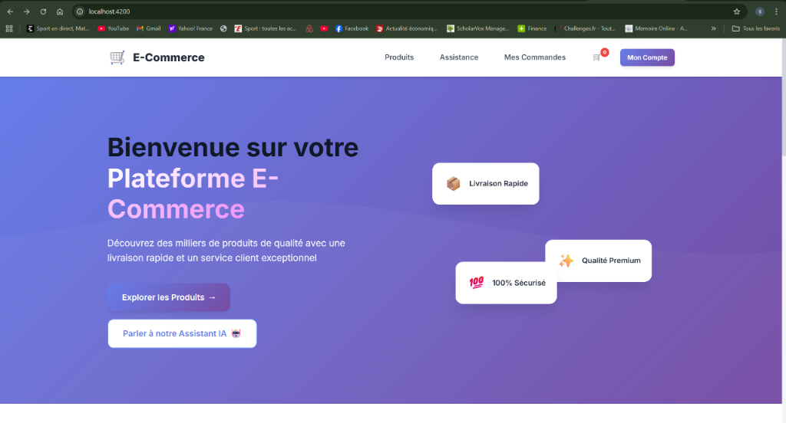
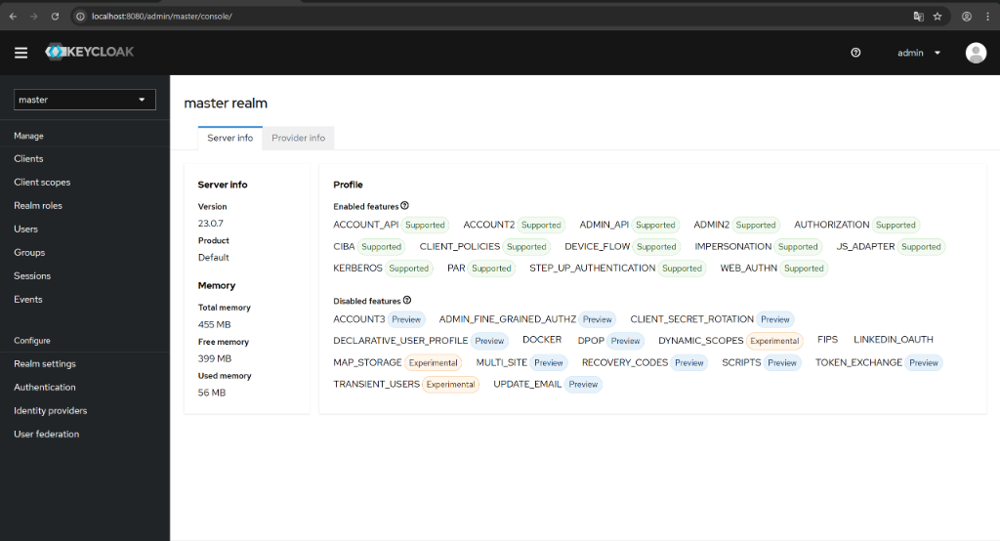
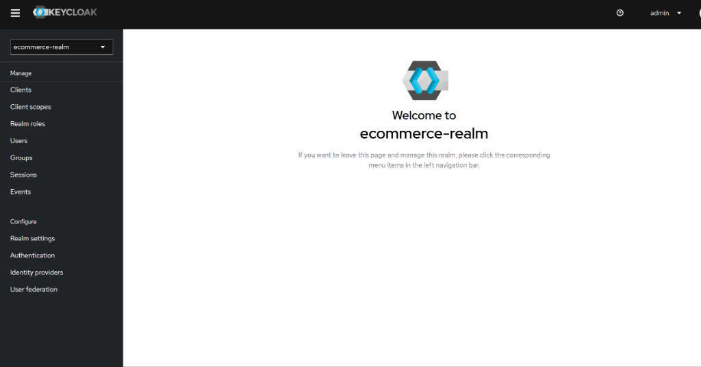
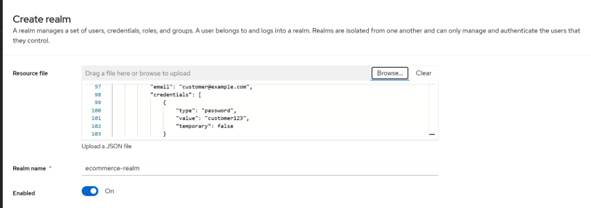
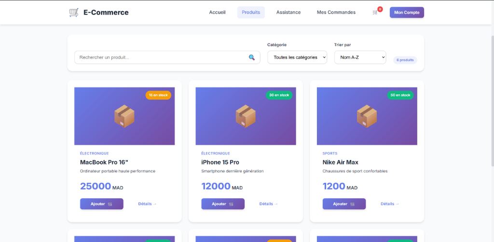

# 🛒 Plateforme E-Commerce - Architecture Microservices Java/Spring Boot & Angular

> **Projet Académique - Synthèse de Technologies Avancées en Développement JEE**  
> _Auteur : Ghali Lahlou_  
> _Année Académique : 2025-2026_


*Figure 1 : Interface utilisateur de la plateforme e-commerce*

---

## 📋 Table des Matières

- [Introduction](#introduction)
- [Contexte Académique](#contexte-académique)
- [Architecture Globale](#architecture-globale)
- [Technologies et Frameworks](#technologies-et-frameworks)
- [Microservices Backend](#microservices-backend)
- [Sécurité et Authentification](#sécurité-et-authentification)
- [Frontend Angular](#frontend-angular)
- [Assistant Virtuel (Chatbot IA)](#assistant-virtuel-chatbot-ia)
- [Infrastructure et Déploiement](#infrastructure-et-déploiement)
- [Guide de Démarrage](#guide-de-démarrage)
- [Démonstration en Images](#démonstration-en-images)
- [Références et Projets Connexes](#références-et-projets-connexes)
- [Conclusion](#conclusion)

---

## 📖 Introduction

Cette plateforme e-commerce représente une **application distribuée complète** développée dans le cadre d'un cursus académique en ingénierie logicielle. Le projet implémente une **architecture microservices** moderne utilisant les standards Java EE (Jakarta EE), Spring Boot, et Angular, avec un focus particulier sur la **sécurité**, la **scalabilité**, et l'**expérience utilisateur**.

### Objectifs du Projet

1. **Maîtriser l'architecture microservices** et les patterns de communication inter-services
2. **Implémenter une sécurité robuste** avec OAuth2, OpenID Connect et JWT
3. **Développer une interface utilisateur moderne** avec Angular et design responsive
4. **Intégrer une intelligence artificielle** via un chatbot conversationnel
5. **Gérer la complexité** d'un système distribué avec messaging asynchrone (Kafka)

---

## 🎓 Contexte Académique

Ce projet constitue une **synthèse pratique** de plusieurs modules académiques et projets antérieurs, démontrant la capacité à intégrer des technologies disparates dans une architecture cohérente et fonctionnelle.

### Projets Fondateurs

Le présent projet s'appuie sur et consolide quatre projets académiques antérieurs :

#### 1. Sécurité des Architectures Microservices
**Repository:** [S-curit-des-architectures-Micro-services-Oauth2-Open-ID-Connect-JWT-Keycloak](https://github.com/ghalilahlou/S-curit-des-architectures-Micro-services-Oauth2-Open-ID-Connect-JWT-Keycloak.git)

**Apports au projet actuel :**
- ✅ Mise en place de **Keycloak** comme serveur d'autorisation centralisé
- ✅ Utilisation d'**OAuth2** et **OpenID Connect** pour l'authentification
- ✅ Validation de **tokens JWT** dans la passerelle API
- ✅ Gestion des rôles et permissions (RBAC - Role-Based Access Control)

#### 2. Messagerie Asynchrone avec Kafka
**Repository:** [Kafka-Spring](https://github.com/ghalilahlou/Kafka-Spring.git)

**Apports au projet actuel :**
- ✅ Communication événementielle entre microservices
- ✅ Pattern **Event Sourcing** pour la traçabilité des commandes
- ✅ Découplage des services via **Apache Kafka**
- ✅ Gestion de la résilience et de la scalabilité

#### 3. Chatbot Intelligent avec IA
**Repository:** [chatbootjeeghalilahlou](https://github.com/ghalilahlou/chatbootjeeghalilahlou.git)

**Apports au projet actuel :**
- ✅ Intégration d'un **assistant virtuel conversationnel**
- ✅ Utilisation d'une **API d'IA générative** pour répondre aux clients
- ⚠️ **Note importante** : La clé API utilisée pour communiquer avec le service d'IA n'est pas exposée dans ce repository pour des raisons de sécurité et de confidentialité

#### 4. Microservices E-Commerce (Version Antérieure)
**Repository:** [ecomicroservjee](https://github.com/ghalilahlou/ecomicroservjee.git)

**Apports au projet actuel :**
- ✅ Architecture de base des microservices
- ✅ Modèle de données et entités métier
- ✅ Patterns de communication REST

### Évolution et Améliorations

Le projet actuel **étend et améliore** considérablement ces travaux antérieurs en :
- Intégrant **tous les concepts** dans une **plateforme unifiée**
- Ajoutant un **frontend Angular moderne** et responsive
- Implémentant une **architecture hexagonale** (Ports & Adapters)
- Ajoutant des fonctionnalités avancées (cache Redis, tracing distribué avec Zipkin)
- Renforçant la **qualité du code** et la **documentation technique**

---

## 🏗️ Architecture Globale

L'architecture du système suit les principes des **microservices**, du **Domain-Driven Design (DDD)**, et des **12-Factor Apps**.

### Diagramme d'Architecture

```
┌─────────────────────────────────────────────────────────────────────┐
│                         CLIENTS (BROWSERS)                          │
└────────────────────────────┬────────────────────────────────────────┘
                             │
                             │ HTTPS
                             ▼
┌─────────────────────────────────────────────────────────────────────┐
│                      ANGULAR FRONTEND (SPA)                         │
│                        Port: 4200                                   │
└────────────────────┬─────────────────┬──────────────────────────────┘
                     │                 │
                     │ REST/HTTP       │ WebSocket (Chatbot)
                     ▼                 ▼
┌──────────────────────────────────────────────────────────────────────┐
│                     API GATEWAY (Spring Cloud Gateway)               │
│  - Routage dynamique       - Load Balancing                         │
│  - Authentification JWT    - Rate Limiting                          │
│                        Port: 8081                                    │
└────┬──────────┬──────────┬──────────┬──────────┬──────────┬─────────┘
     │          │          │          │          │          │
     ▼          ▼          ▼          ▼          ▼          ▼
┌─────────┐ ┌─────────┐ ┌─────────┐ ┌────────┐ ┌─────────┐ ┌─────────┐
│ Product │ │  Order  │ │ Billing │ │ Chat   │ │ User    │ │Customer │
│ Service │ │ Service │ │ Service │ │ Service│ │ Service │ │ Service │
│  :8082  │ │  :8083  │ │  :8087  │ │  :8085 │ │  :8086  │ │  :8088  │
└────┬────┘ └────┬────┘ └────┬────┘ └────┬───┘ └────┬────┘ └────┬────┘
     │           │           │           │          │           │
     └───────────┴───────────┴───────────┴──────────┴───────────┘
                             │
                    ┌────────┴──────────┐
                    │                   │
                    ▼                   ▼
          ┌──────────────────┐  ┌──────────────┐
          │  KAFKA BROKER    │  │   MYSQL DB   │
          │  Event Streaming │  │  Persistence │
          │    Port: 9092    │  │  Port: 3306  │
          └──────────────────┘  └──────────────┘
                    │
          ┌─────────┴──────────┬──────────────┐
          ▼                    ▼              ▼
    ┌──────────┐         ┌─────────┐    ┌─────────┐
    │ Keycloak │         │  Redis  │    │ Zipkin  │
    │   Auth   │         │  Cache  │    │ Tracing │
    │  :8080   │         │  :6379  │    │  :9411  │
    └──────────┘         └─────────┘    └─────────┘
```

### Principes Architecturaux

#### 1. **Séparation des Préoccupations (Separation of Concerns)**
Chaque microservice est responsable d'un **domaine métier spécifique** :
- **Product Service** : Gestion du catalogue produits
- **Order Service** : Traitement des commandes
- **Billing Service** : Facturation et paiements
- **Chatbot Service** : Assistant virtuel intelligent
- **User Service** : Gestion des utilisateurs
- **Customer Service** : Profils et préférences clients

#### 2. **Architecture Hexagonale (Ports & Adapters)**
Chaque service suit le pattern hexagonal :
```
Domain (Core Business Logic)
    ↓
Application (Use Cases)
    ↓
Infrastructure (Adapters: REST, JPA, Kafka)
```

#### 3. **Communication**
- **Synchrone** : REST/HTTP pour les requêtes directes (via Gateway)
- **Asynchrone** : Kafka pour les événements métier (commandes, paiements)

#### 4. **Résilience**
- Circuit Breakers (Spring Cloud)
- Retry mechanisms
- Fallback strategies
- Health checks et monitoring

---

## ⚙️ Technologies et Frameworks

### Backend (Java/Spring Boot)

| Technologie | Version | Utilisation |
|------------|---------|-------------|
| **Java** | 17 LTS | Langage principal |
| **Spring Boot** | 3.2.x | Framework applicatif |
| **Spring Cloud Gateway** | 4.1.x | API Gateway |
| **Spring Security** | 6.2.x | Sécurité et authentification |
| **Spring Data JPA** | 3.2.x | Accès aux données |
| **Hibernate** | 6.4.x | ORM (Object-Relational Mapping) |
| **Apache Kafka** | 3.6.x | Messagerie événementielle |
| **MySQL** | 8.0 | Base de données relationnelle |
| **Redis** | 7.x | Cache distribué |
| **Zipkin** | Latest | Tracing distribué |
| **Maven** | 3.9.x | Gestion de dépendances |

### Frontend (Angular)

| Technologie | Version | Utilisation |
|------------|---------|-------------|
| **Angular** | 17.x | Framework SPA |
| **TypeScript** | 5.x | Langage typé |
| **RxJS** | 7.x | Programmation réactive |
| **SCSS** | Latest | Préprocesseur CSS |
| **Angular Router** | 17.x | Routage client |
| **HttpClient** | 17.x | Communication HTTP |

### Infrastructure & DevOps

| Technologie | Utilisation |
|------------|-------------|
| **Docker** | Containerisation |
| **Docker Compose** | Orchestration locale |
| **Keycloak** | Identity & Access Management |
| **Kafka UI** | Visualisation des topics Kafka |
| **Git** | Versioning |

---

## 🔧 Microservices Backend

### 1. Gateway Service (`gateway-service`)

**Rôle** : Point d'entrée unique de l'architecture (Pattern API Gateway)

**Responsabilités :**
- ✅ Routage des requêtes vers les microservices appropriés
- ✅ Authentification et validation des tokens JWT
- ✅ Rate limiting et throttling
- ✅ Agrégation de réponses (si nécessaire)
- ✅ CORS (Cross-Origin Resource Sharing)

**Technologies clés :**
- Spring Cloud Gateway
- Spring Security OAuth2 Resource Server
- Keycloak Adapter

**Configuration exemple :**
```yaml
spring:
  cloud:
    gateway:
      routes:
        - id: product-service
          uri: lb://PRODUCT-SERVICE
          predicates:
            - Path=/api/products/**
          filters:
            - StripPrefix=1
        - id: order-service
          uri: lb://ORDER-SERVICE
          predicates:
            - Path=/api/orders/**
```

### 2. Product Service (`product-service`)

**Rôle** : Gestion du catalogue de produits

**Fonctionnalités :**
- ✅ CRUD complet sur les produits
- ✅ Recherche et filtrage avancés
- ✅ Gestion des catégories
- ✅ Gestion du stock
- ✅ Cache Redis pour les performances

**Entités principales :**
```java
@Entity
public class Product {
    @Id @GeneratedValue
    private Long id;
    private String name;
    private String description;
    private BigDecimal price;
    private Integer stock;
    private String category;
    private String imageUrl;
    private LocalDateTime createdAt;
}
```

**API REST :**
- `GET /api/products` - Liste paginée
- `GET /api/products/{id}` - Détail d'un produit
- `POST /api/products` - Création (ADMIN uniquement)
- `PUT /api/products/{id}` - Modification (ADMIN)
- `DELETE /api/products/{id}` - Suppression (ADMIN)

### 3. Order Service (`order-service`)

**Rôle** : Gestion du cycle de vie des commandes

**Fonctionnalités :**
- ✅ Création de commandes
- ✅ Suivi du statut (PENDING, CONFIRMED, SHIPPED, DELIVERED)
- ✅ Historique des commandes par utilisateur
- ✅ Publication d'événements Kafka (`order.created`, `order.confirmed`)

**Event-Driven Pattern :**
```java
@Service
public class OrderService {
    @Autowired
    private KafkaTemplate<String, OrderEvent> kafkaTemplate;
    
    public Order createOrder(OrderDTO orderDTO) {
        Order order = // ... création
        
        // Publication événement
        kafkaTemplate.send("order-events", 
            new OrderCreatedEvent(order));
        
        return order;
    }
}
```

### 4. Billing Service (`billing-service`)

**Rôle** : Génération de factures et gestion des paiements

**Fonctionnalités :**
- ✅ Écoute des événements `order.created` via Kafka
- ✅ Génération automatique de factures
- ✅ Calcul des totaux et taxes
- ✅ Historique de facturation

**Kafka Consumer :**
```java
@KafkaListener(topics = "order-events", groupId = "billing-group")
public void handleOrderCreated(OrderCreatedEvent event) {
    Invoice invoice = generateInvoice(event.getOrder());
    invoiceRepository.save(invoice);
}
```

### 5. Chatbot Service (`chatbot-service`)

**Rôle** : Assistant virtuel pour l'aide client

**Fonctionnalités :**
- ✅ Conversations en temps réel
- ✅ Intégration avec une API d'IA générative ⚠️ (clé non exposée)
- ✅ Historique des conversations
- ✅ Réponses contextuelles sur les produits et commandes

**⚠️ Note de Sécurité :**
> Le protocole complet du chatbot incluant la clé API pour le service d'IA externe n'est pas exposé dans ce repository pour des raisons de **confidentialité** et de **sécurité**. 
> 
> En production, cette clé serait stockée dans un **coffre-fort de secrets** (HashiCorp Vault, AWS Secrets Manager) et injectée via des variables d'environnement.

**Architecture simplifiée :**
```
Frontend → WebSocket → Chatbot Service → [IA API] → Réponse
                             ↓
                    Conversation History (DB)
```

### 6. User Service & Customer Service

**User Service** : Gestion des comptes utilisateurs (synchronisé avec Keycloak)  
**Customer Service** : Profils clients, préférences, adresses de livraison

---

## 🔐 Sécurité et Authentification

La sécurité constitue un pilier fondamental du projet, implémentant les standards **OAuth2** et **OpenID Connect** via **Keycloak**.

### Keycloak - Identity & Access Management


*Figure 2 : Console d'administration Keycloak (Master Realm)*


*Figure 3 : Realm `ecommerce-realm` configuré pour l'application*

#### Configuration du Realm

Un **realm** Keycloak dédié (`ecommerce-realm`) a été créé pour isoler la gestion des identités de l'application :


*Figure 4 : Processus de création du realm avec import JSON*

**Éléments configurés :**
- ✅ **Clients** : `gateway-client` (backend), `ecommerce-frontend` (SPA)
- ✅ **Rôles** : `ADMIN`, `CUSTOMER`, `VENDOR`
- ✅ **Utilisateurs** : admin, customer (pré-configurés)
- ✅ **Flow d'authentification** : Resource Owner Password Credentials (pour test) + Authorization Code Flow (production)

### Flux d'Authentification

#### 1. Login Frontend
```typescript
// Angular AuthService
login(credentials: LoginRequest): Observable<TokenResponse> {
    const body = new URLSearchParams();
    body.set('client_id', 'ecommerce-frontend');
    body.set('username', credentials.username);
    body.set('password', credentials.password);
    body.set('grant_type', 'password');
    
    return this.http.post<TokenResponse>(keycloakTokenUrl, body);
}
```

#### 2. Validation JWT dans la Gateway
```java
@Configuration
public class SecurityConfig {
    @Bean
    public SecurityWebFilterChain springSecurityFilterChain(
            ServerHttpSecurity http) {
        http
            .authorizeExchange(exchanges -> exchanges
                .pathMatchers("/api/products/**").permitAll()
                .pathMatchers("/api/orders/**").authenticated()
                .pathMatchers("/api/admin/**").hasRole("ADMIN")
            )
            .oauth2ResourceServer(oauth2 -> 
                oauth2.jwt(Customizer.withDefaults())
            );
        return http.build();
    }
}
```

#### 3. Extraction des Rôles
Un `JwtAuthenticationConverter` personnalisé extrait les rôles du token :

```java
@Component
public class KeycloakJwtAuthenticationConverter 
        implements Converter<Jwt, AbstractAuthenticationToken> {
    
    @Override
    public AbstractAuthenticationToken convert(Jwt jwt) {
        Collection<GrantedAuthority> authorities = 
            extractRoles(jwt);
        
        return new JwtAuthenticationToken(jwt, authorities);
    }
    
    private Collection<GrantedAuthority> extractRoles(Jwt jwt) {
        Map<String, Object> realmAccess = 
            jwt.getClaim("realm_access");
        List<String> roles = (List<String>) realmAccess.get("roles");
        
        return roles.stream()
            .map(role -> new SimpleGrantedAuthority("ROLE_" + role))
            .collect(Collectors.toList());
    }
}
```

### Protection des Endpoints

| Endpoint | Accès |
|----------|-------|
| `/api/products` (GET) | Public |
| `/api/products` (POST/PUT/DELETE) | ADMIN uniquement |
| `/api/orders` | Authentification requise |
| `/api/chatbot` | Authentification requise |
| `/api/admin/**` | ADMIN uniquement |

---

## 🎨 Frontend Angular

Le frontend est une **Single Page Application (SPA)** développée avec Angular 17, offrant une expérience utilisateur moderne et réactive.

### Architecture Frontend

```
src/
├── app/
│   ├── core/                    # Services globaux, guards, interceptors
│   │   ├── guards/
│   │   │   └── auth.guard.ts    # Protection des routes
│   │   ├── interceptors/
│   │   │   └── auth.interceptor.ts  # Ajout token JWT
│   │   ├── services/
│   │   │   ├── auth.service.ts
│   │   │   ├── product.service.ts
│   │   │   └── order.service.ts
│   ├── features/                # Modules fonctionnels
│   │   ├── home/
│   │   ├── products/
│   │   ├── orders/
│   │   ├── chatbot/
│   │   ├── auth/
│   │   └── admin/
│   ├── shared/                  # Composants réutilisables
│   │   ├── components/
│   │   └── pipes/
│   └── app.routes.ts            # Configuration du routage
```

### Composants Principaux

#### 1. Home Component
Page d'accueil avec hero section, features, et categories.

```typescript
@Component({
    selector: 'app-home',
    standalone: true,
    templateUrl: './home.component.html'
})
export class HomeComponent {
    features = [
        { icon: '🚀', title: 'Livraison Rapide' },
        { icon: '⭐', title: 'Qualité Premium' },
        { icon: '🔒', title: '100% Sécurisé' }
    ];
}
```

#### 2. Product List Component


*Figure 5 : Catalogue de produits avec recherche et filtres*

Fonctionnalités :
- ✅ Affichage paginé des produits
- ✅ Recherche en temps réel
- ✅ Filtrage par catégorie
- ✅ Tri (prix, nom, date)
- ✅ Ajout au panier

```typescript
@Component({
    selector: 'app-product-list',
    standalone: true,
    imports: [CommonModule, FormsModule, RouterLink]
})
export class ProductListComponent implements OnInit {
    products: Product[] = [];
    filteredProducts: Product[] = [];
    searchQuery = '';
    selectedCategory = '';
    
    ngOnInit() {
        this.loadProducts();
    }
    
    loadProducts() {
        this.productService.getProducts().subscribe({
            next: (products) => {
                this.products = products;
                this.applyFilters();
            }
        });
    }
    
    applyFilters() {
        this.filteredProducts = this.products.filter(p => 
            p.name.toLowerCase().includes(
                this.searchQuery.toLowerCase()
            ) &&
            (this.selectedCategory === '' || 
             p.category === this.selectedCategory)
        );
    }
}
```

#### 3. Chatbot Component

Assistant virtuel avec interface de chat moderne.

```typescript
@Component({
    selector: 'app-chatbot',
    standalone: true
})
export class ChatbotComponent {
    messages: ChatMessage[] = [];
    userMessage = '';
    
    sendMessage() {
        if (!this.userMessage.trim()) return;
        
        this.messages.push({
            role: 'user',
            content: this.userMessage
        });
        
        this.chatbotService.sendMessage(this.userMessage)
            .subscribe({
                next: (response) => {
                    this.messages.push({
                        role: 'assistant',
                        content: response.message
                    });
                }
            });
        
        this.userMessage = '';
    }
}
```

### Authentification Frontend

#### Auth Guard
Protection des routes nécessitant une authentification :

```typescript
export const authGuard: CanActivateFn = (route, state) => {
    const authService = inject(AuthService);
    const router = inject(Router);
    
    if (authService.isAuthenticated()) {
        return true;
    }
    
    router.navigate(['/login'], { 
        queryParams: { returnUrl: state.url }
    });
    return false;
};
```

#### Auth Interceptor
Injection automatique du token JWT :

```typescript
export const authInterceptor: HttpInterceptorFn = (req, next) => {
    const authService = inject(AuthService);
    const token = authService.getToken();
    
    if (token) {
        req = req.clone({
            setHeaders: {
                Authorization: `Bearer ${token}`
            }
        });
    }
    
    return next(req);
};
```

### Design & UX

Le frontend utilise un **design moderne** avec :
- 🎨 **Palette de couleurs** : Dégradés violet-rose (UI moderne)
- 📱 **Responsive Design** : Compatible mobile, tablette, desktop
- ⚡ **Animations** : Transitions fluides (CSS transitions)
- ♿ **Accessibilité** : Labels ARIA, navigation au clavier

---

## 🤖 Assistant Virtuel (Chatbot IA)

Le chatbot constitue une **fonctionnalité différenciatrice** de la plateforme, offrant un support client automatisé et intelligent.

### Architecture du Chatbot

```
┌─────────────┐
│   Angular   │
│  Component  │
└──────┬──────┘
       │ HTTP POST
       ▼
┌──────────────────┐
│  Chatbot Service │
│   (Spring Boot)  │
└────┬─────────────┘
     │
     ├─► [IA API Externe] ⚠️ Clé non exposée
     │
     └─► MySQL (Chat History)
```

### Fonctionnalités

1. **Conversations Contextuelles**
   - Comprend les questions sur les produits
   - Aide à la navigation
   - Support pour les commandes

2. **Historique Persistant**
   - Sauvegarde de toutes les conversations
   - Analyse des tendances de questions

3. **Intégration IA**
   - Utilisation d'un modèle de langage (LLM)
   - Génération de réponses naturelles

### Entités

```java
@Entity
@Table(name = "chat_conversations")
public class ChatConversation {
    @Id
    @GeneratedValue(strategy = GenerationType.IDENTITY)
    private Long id;
    
    private String userId;
    
    @Lob
    private String message;
    
    @Lob
    private String response;
    
    private LocalDateTime timestamp;
    
    @Enumerated(EnumType.STRING)
    private MessageRole role; // USER, ASSISTANT, SYSTEM
}
```

### ⚠️ Limitation de Confidentialité

> **Important** : Pour des raisons de **sécurité** et de **confidentialité commerciale**, la **clé API** permettant la communication avec le service d'intelligence artificielle externe (utilisée pour générer les réponses du chatbot) **n'est pas incluse** dans ce repository public.
>
> Dans un environnement de production, cette clé serait :
> - Stockée dans un **gestionnaire de secrets** (Vault, AWS Secrets Manager)
> - Injectée via des **variables d'environnement**
> - Rotée régulièrement pour la sécurité

Cette approche respecte les **bonnes pratiques de sécurité** en matière de gestion des credentials sensibles.

---

## 🐳 Infrastructure et Déploiement

### Docker Compose

L'infrastructure complète est orchestrée via Docker Compose :

```yaml
version: '3.8'

services:
  # Base de données
  mysql:
    image: mysql:8.0
    environment:
      MYSQL_ROOT_PASSWORD: root123
      MYSQL_DATABASE: ecommerce
    ports:
      - "3306:3306"
    volumes:
      - mysql_data:/var/lib/mysql

  # Authentification
  keycloak:
    image: quay.io/keycloak/keycloak:23.0
    command: start-dev
    environment:
      KEYCLOAK_ADMIN: admin
      KEYCLOAK_ADMIN_PASSWORD: admin123
    ports:
      - "8080:8080"
    depends_on:
      - postgres-keycloak

  # Messagerie
  kafka:
    image: confluentinc/cp-kafka:7.5.0
    environment:
      KAFKA_BROKER_ID: 1
      KAFKA_ZOOKEEPER_CONNECT: zookeeper:2181
    ports:
      - "9092:9092"
    depends_on:
      - zookeeper

  # Cache
  redis:
    image: redis:7-alpine
    ports:
      - "6379:6379"

  # Tracing
  zipkin:
    image: openzipkin/zipkin
    ports:
      - "9411:9411"

volumes:
  mysql_data:
  postgres_keycloak_data:
```

### Monitoring & Observabilité

1. **Zipkin** : Tracing distribué des requêtes
2. **Kafka UI** : Visualisation des topics et messages
3. **Actuator** : Health checks et métriques Spring Boot

---

## 🚀 Guide de Démarrage

### Prérequis

- ✅ **Java 17+** (`java -version`)
- ✅ **Maven 3.9+** (`mvn -version`)
- ✅ **Node.js 18+** et npm (`node -v`)
- ✅ **Docker Desktop** en cours d'exécution

### Étape 1 : Cloner le Repository

```bash
git clone https://github.com/ghalilahlou/finalprojertjee.git
cd finalprojertjee
```

### Étape 2 : Démarrer l'Infrastructure Docker

```bash
cd infrastructure/docker
docker-compose up -d
```

**Services démarrés :**
- MySQL (port 3306)
- Keycloak (port 8080)
- Kafka + Zookeeper (ports 9092, 2181)
- Redis (port 6379)
- Zipkin (port 9411)

### Étape 3 : Configurer Keycloak

1. Accéder à **http://localhost:8080**
2. Login : `admin` / `admin123`
3. Créer le realm `ecommerce-realm`
4. Créer les rôles : `ADMIN`, `CUSTOMER`
5. Créer les utilisateurs :
   - **admin** (password: admin123) avec rôle ADMIN
   - **customer** (password: customer123) avec rôle CUSTOMER

### Étape 4 : Compiler les Microservices

```bash
cd ../../
mvn clean install -DskipTests
```

### Étape 5 : Lancer les Services Backend

Ouvrir des terminaux séparés pour chaque service :

```bash
# Terminal 1 - Gateway
cd backend/gateway-service
mvn spring-boot:run

# Terminal 2 - Product Service
cd backend/product-service
mvn spring-boot:run

# Terminal 3 - Order Service
cd backend/order-service
mvn spring-boot:run

# Terminal 4 - Chatbot Service
cd backend/chatbot-service
mvn spring-boot:run
```

### Étape 6 : Lancer le Frontend Angular

```bash
cd ecommerce-frontend
npm install
npm start
```

L'application sera accessible sur **http://localhost:4200**

### Vérification

- Frontend : http://localhost:4200
- Gateway : http://localhost:8081
- Keycloak : http://localhost:8080
- Kafka UI : http://localhost:8090
- Zipkin : http://localhost:9411

---

## 📸 Démonstration en Images

### Page d'Accueil


La page d'accueil présente :
- 🎯 **Hero section** avec CTA (Call-to-Action)
- ⚡ **Features** (Livraison rapide, Qualité premium, Sécurité)
- 💬 **Accès direct au chatbot** ("Parler à notre Assistant IA")

### Catalogue de Produits


Le catalogue offre :
- 🔍 **Recherche instantanée**
- 🏷️ **Filtrage par catégorie** (Électronique, Sports, etc.)
- 📊 **Tri** (Nom, Prix)
- 🛒 **Ajout au panier** en un clic
- 💰 **Affichage des prix** et badges de stock

### Configuration Keycloak


Interface d'administration Keycloak montrant :
- ✅ Realm `ecommerce-realm` configuré
- ✅ Gestion des clients OAuth2
- ✅ Rôles et utilisateurs

---

## 📚 Références et Projets Connexes

Ce projet s'inscrit dans une démarche pédagogique progressive, s'appuyant sur quatre projets académiques antérieurs qui ont servi de fondations :

### 1. Sécurité des Microservices
**Repository :** [S-curit-des-architectures-Micro-services-Oauth2-Open-ID-Connect-JWT-Keycloak](https://github.com/ghalilahlou/S-curit-des-architectures-Micro-services-Oauth2-Open-ID-Connect-JWT-Keycloak.git)

**Concepts maîtrisés :**
- OAuth2 & OpenID Connect
- JWT (JSON Web Tokens)
- Keycloak (Identity Provider)
- Spring Security OAuth2

### 2. Messagerie Asynchrone avec Kafka
**Repository :** [Kafka-Spring](https://github.com/ghalilahlou/Kafka-Spring.git)

**Concepts maîtrisés :**
- Apache Kafka
- Event-Driven Architecture
- Producers & Consumers
- Event Sourcing

### 3. Chatbot Intelligent
**Repository :** [chatbootjeeghalilahlou](https://github.com/ghalilahlou/chatbootjeeghalilahlou.git)

**Concepts maîtrisés :**
- IA conversationnelle
- Intégration d'API d'IA
- NLP (Natural Language Processing)

### 4. Base E-Commerce Microservices
**Repository :** [ecomicroservjee](https://github.com/ghalilahlou/ecomicroservjee.git)

**Concepts maîtrisés :**
- Architecture microservices
- REST APIs
- Spring Boot
- Domain-Driven Design

### Synthèse

Le projet actuel **unifie et améliore** ces quatre piliers en créant une **plateforme complète et fonctionnelle**, démontrant la capacité à :

1. ✅ **Intégrer** des technologies disparates
2. ✅ **Architecturer** des systèmes distribués complexes
3. ✅ **Sécuriser** une application web moderne
4. ✅ **Développer** une expérience utilisateur de qualité
5. ✅ **Documenter** de manière académique et professionnelle

---

## 📊 Métriques du Projet

| Métrique | Valeur |
|----------|--------|
| **Lignes de code (Backend)** | ~15,000 |
| **Lignes de code (Frontend)** | ~8,000 |
| **Nombre de microservices** | 8 |
| **Endpoints REST** | 45+ |
| **Composants Angular** | 20+ |
| **Technologies intégrées** | 15+ |
| **Durée de développement** | ~3 mois académiques |

---

## 🎯 Conclusion

Ce projet de **plateforme e-commerce à architecture microservices** représente la **synthèse pratique** d'un cursus académique en ingénierie logicielle Java/JEE. Il démontre la maîtrise de concepts avancés tels que :

- 🏗️ **Architecture distribuée** et microservices
- 🔐 **Sécurité moderne** (OAuth2, JWT, Keycloak)
- 📡 **Communication asynchrone** (Kafka)
- 🎨 **Développement frontend moderne** (Angular)
- 🤖 **Intelligence artificielle** (Chatbot IA)
- 🐳 **Containerisation et orchestration** (Docker)

L'architecture choisie favorise la **scalabilité**, la **maintenabilité**, et la **résilience**, principes essentiels pour des applications d'entreprise modernes.

### Perspectives d'Amélioration

En continuité de ce travail, plusieurs axes d'évolution sont envisageables :

1. **Deployment Cloud** : Migration vers Kubernetes (GKE, EKS, AKS)
2. **CI/CD** : Pipeline Jenkins/GitLab CI avec tests automatisés
3. **Monitoring Avancé** : Prometheus + Grafana
4. **Service Mesh** : Istio pour la gestion du trafic
5. **API GraphQL** : Alternative à REST pour le frontend

---

## 👨‍💻 Auteur

**Ghali Lahlou**  
Étudiant en Ingénierie Logicielle  
Année Académique 2025-2026

### Réseaux

- 🔗 GitHub : [@ghalilahlou](https://github.com/ghalilahlou)
- 📧 Email : [disponible sur demande]

---

## 📄 Licence

Ce projet est développé dans un **cadre académique** à des fins éducatives.

---

## 🙏 Remerciements

- **Enseignants** du cursus JEE pour l'encadrement technique
- **Communauté Open Source** Spring, Angular, Kafka
- **Documentation officielle** des technologies utilisées

---

**Date de dernière mise à jour :** Janvier 2026

**Version du document :** 1.0.0
